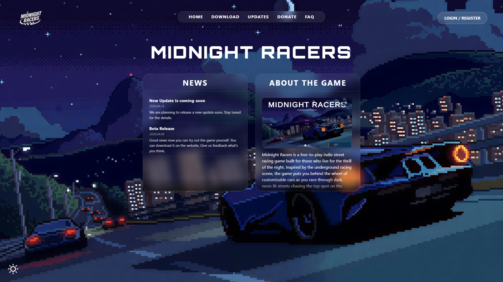
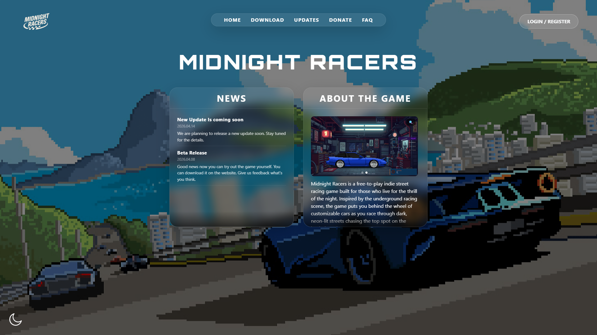
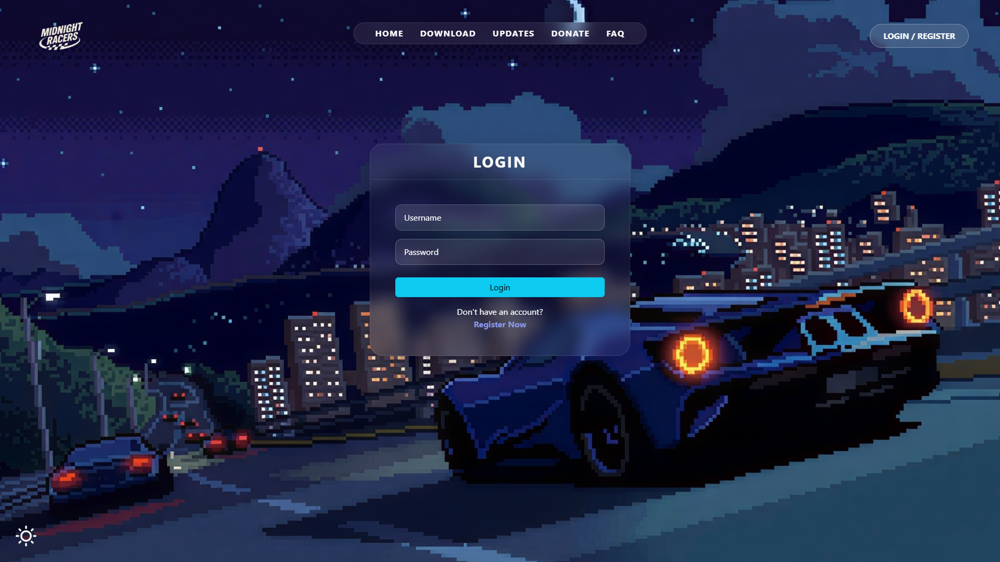
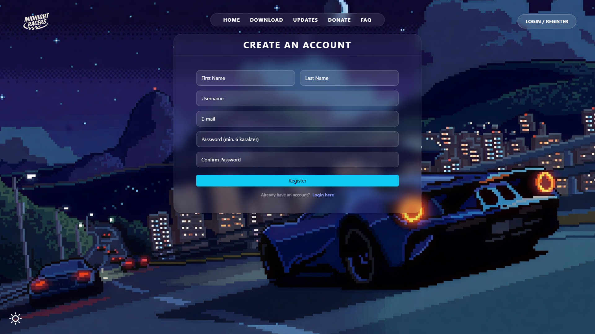
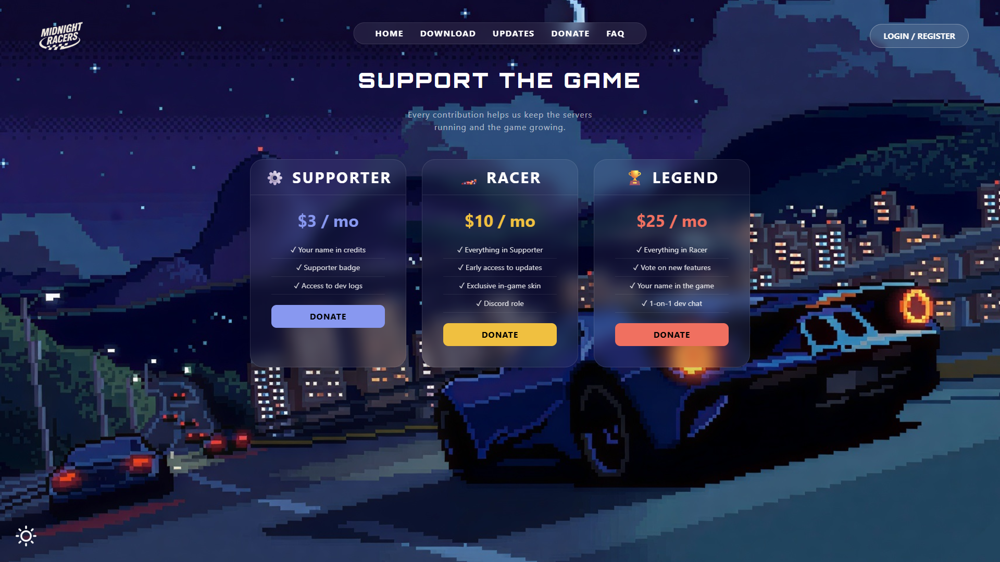
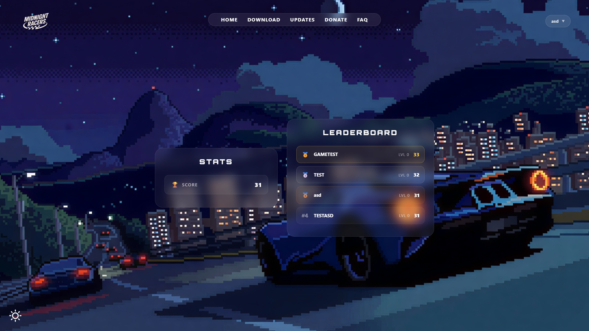
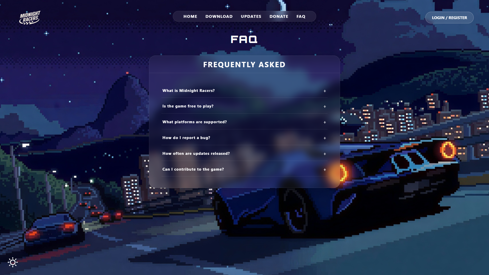
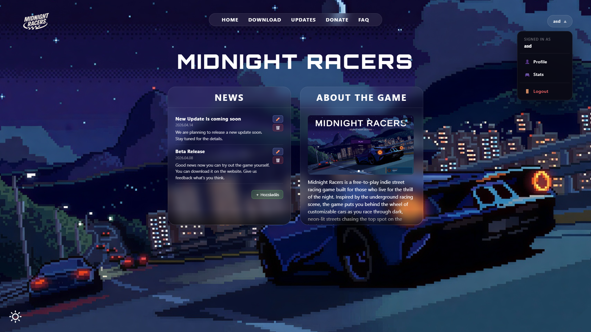

<div align="center">

# 🏁 MIDNIGHT RACERS — FRONTEND

<p>
  
  
  
  
  
</p>

**🌃 Az aszfalt sosem alszik. 🌃**

*A Midnight Racers — egy pixel art indie street racing játék — hivatalos weboldalának frontendje.*

</div>

---

## 📖 A projektről

A **Midnight Racers** egy free-to-play indie street racing játék, ami az éjszakai underground versenyek hangulatát idézi. Ez a repó a játék köré épülő közösségi weboldal **frontend** részét tartalmazza — itt regisztrálnak a játékosok, töltik le a játékot, olvassák a híreket, donate-elnek, és nézegetik a leaderboardot.

A frontend **React 19** + **Vite** alapokon készült, **Bootstrap 5** stílusozással, és egy különálló **Node.js** backendhez kapcsolódik token-alapú autentikációval.

> 🔗 **Backend repó:** [Midnight Racers Backend](https://github.com/llama072/Midnight_Racers_BackEnd)

## ✨ Funkciók

- 🌗 **Dark / Light mód** — ThemeContext alapú téma váltó (a hold/nap ikonnal a sarokban)
- 🔐 **Regisztráció & bejelentkezés** — JWT token alapú auth, `localStorage`-ben tárolva
- 👤 **Profil kezelés** — adatok módosítása, jelszó változtatás, fiók törlés (jelszó megerősítéssel)
- 📰 **Hírek (News)** — listázás, admin által szerkeszthető / törölhető / új hír felvehető
- 🎮 **About the Game** — képgaléria carousel-lel a játékról
- ⬇️ **Download oldal** — a játék letöltése
- 💸 **Donate oldal** — három támogatói szint (Supporter $3 / Racer $10 / Legend $25)
- ❓ **FAQ** — accordion stílusú gyakran ismételt kérdések
- 🏆 **Stats & Leaderboard** — saját score és top játékosok listája
- 🛠️ **Admin felület** — hírek és „home kártyák" inline szerkesztése
- 📱 **Reszponzív dizájn** — desktopon és mobilon is működik

## 🖼️ Képernyőképek

<table>
  <tr>
    <td align="center" width="50%">
      <br>
      <sub><b>🌙 Főoldal — sötét mód</b></sub>
    </td>
    <td align="center" width="50%">
      <br>
      <sub><b>☀️ Főoldal — világos mód</b></sub>
    </td>
  </tr>
  <tr>
    <td align="center">
      <br>
      <sub><b>🔐 Bejelentkezés</b></sub>
    </td>
    <td align="center">
      <br>
      <sub><b>📝 Regisztráció</b></sub>
    </td>
  </tr>
  <tr>
    <td align="center">
      <br>
      <sub><b>💸 Donate (3 tier)</b></sub>
    </td>
    <td align="center">
      <br>
      <sub><b>🏆 Stats & Leaderboard</b></sub>
    </td>
  </tr>
  <tr>
    <td align="center">
      <br>
      <sub><b>❓ FAQ</b></sub>
    </td>
    <td align="center">
      <br>
      <sub><b>🛠️ Admin nézet (hír szerkesztés)</b></sub>
    </td>
  </tr>
</table>

> 💡 A képek a `screenshots/` mappában találhatók. Ha cserélni akarod őket, csak ugyanezekkel a nevekkel mentsd felül.

## 🛠️ Használt technológiák

| Kategória | Eszközök |
|-----------|----------|
| **Framework** | React 19, React DOM 19 |
| **Build tool** | Vite 7 |
| **Routing** | react-router-dom 7 |
| **UI / Styling** | Bootstrap 5.3, custom CSS, Google Fonts (Orbitron, Anton, Exo 2) |
| **Backend kommunikáció** | `fetch` API + Bearer token, `credentials: 'include'` |
| **Linter** | ESLint 9 (react-hooks, react-refresh) |

## 📂 Mappastruktúra

```
Midnight_Racers_FrontEnd/
├── public/
│   └── vite.svg
├── src/
│   ├── assets/              # Logo, háttér, sun/moon ikonok
│   ├── components/
│   │   ├── Button.jsx
│   │   ├── Card.jsx
│   │   ├── LoginButton.jsx
│   │   ├── Logo.jsx
│   │   ├── Modal.jsx
│   │   ├── Navbar.jsx
│   │   ├── NavMenu.jsx
│   │   ├── PageWrapper.jsx
│   │   └── Textbox.jsx
│   ├── context/
│   │   └── ThemeContext.jsx # Dark / light mód state
│   ├── Pages/
│   │   ├── Home.jsx         # News + About the game
│   │   ├── Login.jsx
│   │   ├── Register.jsx
│   │   ├── Profile.jsx      # Account oldal
│   │   ├── Stats.jsx        # Score + Leaderboard
│   │   ├── Updates.jsx
│   │   ├── Download.jsx
│   │   ├── Donate.jsx
│   │   └── FAQ.jsx
│   ├── App.css
│   ├── index.css
│   └── main.jsx             # Belépési pont, router
├── api.js                   # Központi API hívások (fetch wrapper)
├── index.html
├── vite.config.js
├── eslint.config.js
├── .env.development
└── .env.production
```

## 🚀 Telepítés és futtatás

### Előfeltételek

- **Node.js** 18+ (ajánlott: 20 LTS)
- **npm** vagy **yarn**

### Lépések

```bash
# 1. Klónozd a repót
git clone https://github.com/Bomba343/Midnight_Racers_FrontEnd.git
cd Midnight_Racers_FrontEnd

# 2. Telepítsd a függőségeket
npm install

# 3. Indítsd el dev módban
npm run dev

# 4. Nyisd meg a böngészőben
# http://localhost:5173
```

### Production build

```bash
npm run build      # build a /dist mappába
npm run preview    # lokális preview a buildre
```

### Linting

```bash
npm run lint
```

## ⚙️ Környezeti változók

A backend URL `.env` fájlokból jön (Vite konvenció: `VITE_` prefix):

| Fájl | Mikor aktív | Tartalom |
|------|-------------|----------|
| `.env.development` | `npm run dev` | `VITE_API_BASE=http://localhost:3000` (vagy a saját lokális backend) |
| `.env.production` | `npm run build` | `VITE_API_BASE=https://nodejs216.dszcbaross.edu.hu` |

> 💡 Ha az `api.js`-ben nincs `VITE_API_BASE` beállítva, az alapértelmezett a prod szerver lesz (biztonsági fallback).

## 🔌 Backend API végpontok (használt)

A `api.js` az alábbi végpontokat hívja a backenden:

| Metódus | Útvonal | Funkció |
|---------|---------|---------|
| `POST` | `/regisztracio` | Új felhasználó regisztráció |
| `POST` | `/belepes` | Bejelentkezés (token visszaadás) |
| `POST` | `/kijelentkezes` | Kijelentkezés |
| `GET`  | `/me` | Aktuális user info (admin flag) |
| `GET`  | `/profil-adatok` | Profil adatok lekérése |
| `PUT`  | `/profil-update` | Profil mező módosítás |
| `PUT`  | `/update-password` | Jelszó változtatás |
| `DELETE` | `/profil-delete` | Fiók törlés |
| `GET / PUT` | `/home-cards[/id]` | Főoldal kártyák |
| `GET / POST / PUT / DELETE` | `/news[/id]` | Hírek CRUD |
| `GET` | `/about-gallery` | About the game galéria |

## 🎨 Dizájn

A weboldal stílusa a játék pixel art esztétikájához igazodik:

- 🌙 **Sötét mód** — éjszakai város, csillagos égbolt, neon kék/lila árnyalatok
- ☀️ **Világos mód** — nappali Rio de Janeiro inspirálta háttér
- 🔤 **Tipográfia** — Orbitron (címek), Anton, Exo 2 (Google Fonts)
- 🎴 **Glassmorphism** kártyák, lekerekített sarkok
- 🟦 **Akcentszín** — cián / neon kék (`#00BFFF` környéke)


## 👥 Csapat

| Tag | Szerep |
|-----|--------|
| [**Pap Teofil**](https://github.com/llama072) | Mindenes |
| [**Földi Márk**](https://github.com/Bomba343) | Mindenes |

---

<div align="center">

Made with ❤️ and 🏁 by the **Midnight Racers** team

*„Select your destiny."*

</div>
